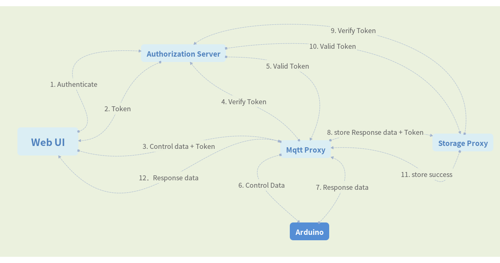

### Ant Framework 

***

#### 概述

>Ant 是一个Iot框架，它参考了openstack swift，beego，海量小文件存储，微服务框架。它致力于让iot平台开发变得更加简洁和高效。

#### Ant 框架简介

***

##### Ant 的整体设计架构如下:

Ant 框架由四个基本服务组成，它们分别是web server，auth server，proxy，mqtt server。Ant是一个以服务为单位，采用Restful风格，高度接耦合的框架，即每个服务都可以部署在不同的地域，而且可以水平扩展，从而可以实现服务的高并发与高可用。

##### Ant 框架服务水平拓展例子：

>Web server：提供用户创建，控制，查看逻辑设备的可视化平台。
>
>Auth server：认证和授权服务
>
>Proxy：数据路由
>
>Mqtt server: 用于和用户物理设备通信

#### Ant 的执行逻辑

***

##### 用户使用web控制物理设备

##### 设备上传数据

